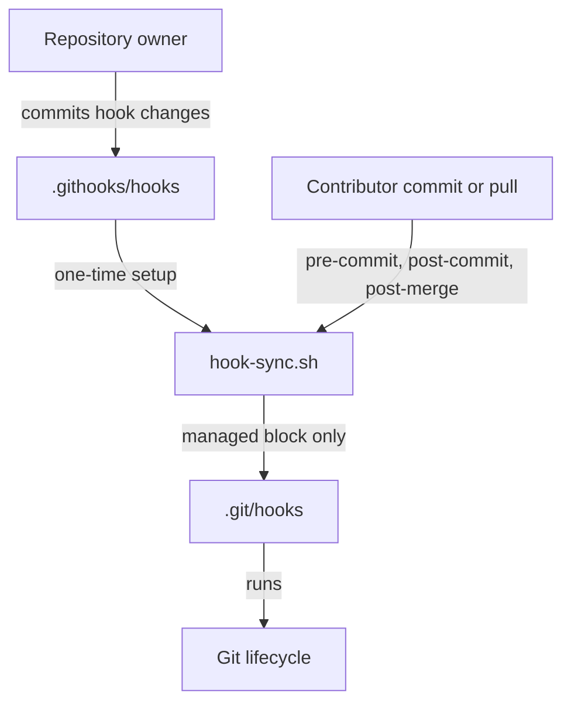

# 🚀 GitHub Repository Template

> A reusable GitHub repository template with documentation, pull-request automation, and repository-managed Git hooks. It is for teams that need consistent project conventions without prescribing an application language, framework, or build system.

---

## 📌 Project Metadata

* **Status:** 🟢 Active
* **Data Classification:** 🌐 Public

> ℹ️ *Use this section to identify which data classes the product handles: Public, Internal, Confidential, and Restricted.*
>
> 🧠 *These classifications align with the [NIST SP 800-122 Guide to Protecting the Confidentiality of Personally Identifiable Information (PII)](https://csrc.nist.gov/publications/detail/sp/800-122/final) framework. **Public** is explicitly classified as non-sensitive data outside NIST's non-public impact levels (Low, Moderate, and High).*

---

## 👥 Maintainers

| Name | Role | Contact |
| :--- | :--- | :--- |
| **Repository owner** | Template maintainer | Add the owning team or GitHub handle when creating a repository. |

---

## 🏗️ Architecture

The `.githooks` directory provides a language- and framework-agnostic way for repository owners to distribute Git hooks. Hook content lives in version control, while a small synchronizer installs or updates only the managed section of each contributor's local `.git/hooks` files.



## ⚡ Tech Stack

| Category | Technology | Usage |
| :--- | :--- | :--- |
| Version control | Git | Repository lifecycle and hook execution |
| Automation | Bash | Hook installation and synchronization |
| Quality | ShellCheck | Static analysis for shell scripts |
| Collaboration | GitHub Actions | Pull request checks and release workflows |

### ⭐ Repository-Managed Hooks

> **Component:** `.githooks`  
> **Responsibility:** Keep repository-owned Git hook content synchronized on contributor machines.  
> **Location:** `.githooks/`  
> **Interfaces:** Git `pre-commit`, `post-commit`, and `post-merge` hooks.

Run the setup script once after cloning:

```bash
bash .githooks/setup.sh
```

After setup, the `pre-commit`, `post-commit`, and `post-merge` lifecycle hooks run the synchronizer. When a repository owner changes a file under `.githooks/hooks/`, each contributor receives the change on their next commit or merge-based pull. Removing a managed source hook removes only its managed block from the local hook, leaving contributor-owned content intact.

Repository owners add hook behavior by creating a file named for a Git hook in `.githooks/hooks/`, such as `pre-push` or `commit-msg`, then committing it. Keep hook code portable and fail clearly when a required project tool is unavailable.

The synchronizer also deploys `.githooks/gitleaks.toml` to the Git-ignored `.gitleaks.toml` at the repository root, where the `pre-commit` secrets scan and local Gitleaks runs load it. Edit and commit `.githooks/gitleaks.toml` to change the rules; local edits to the deployed copy are overwritten.

## 📦 Installation

Create a repository from this template or clone an existing repository, then initialize its managed hooks:

```bash
git clone https://github.com/your-org/your-repo.git
cd your-repo
bash .githooks/setup.sh
```

The hook framework requires only Git and Bash. The baseline `pre-commit` hook also requires [Gitleaks](https://github.com/gitleaks/gitleaks) to scan staged changes for secrets. Application-specific prerequisites belong in the repository created from this template.

## Adopting This Template

After creating a repository from this template, initialize it according to its intended purpose before treating the example content as project documentation:

* Replace the project name, purpose, maintainers, component boundaries, architecture, and technology stack in the README.
* Replace sample installation, build, test, and release commands with commands that have been verified for the new project.
* Classify the data the project handles, document network exposure and security controls, and set a real vulnerability-reporting path.
* Review the pull-request categories, templates, checklist wording, and required checks; keep the router mappings and template files aligned.
* Preserve and adapt `.githooks/`, Gitleaks, PR security automation, and release SBOM, attribution, provenance, attestation, and signing controls. Replace example release assets and build steps with the actual artifacts; do not publish the sample `asset.txt` as a real product.
* Update the SBOM inputs and third-party attribution notices as build outputs and dependencies change. Resolve license data from authoritative sources.
* Review [CONTRIBUTING.md](CONTRIBUTING.md), [SECURITY.md](SECURITY.md), [LICENSE](LICENSE), and [NOTICE](NOTICE) for fit, retaining required license and attribution notices.
* Complete the one-time steps in `.github/copilot-instructions.md` and change `INIT_TEMPLATE=true` to `false` after the initial purpose and tooling review.

### Protect the Default Branch

In GitHub, open **Settings → Rules → Rulesets** (or **Branches** for classic protection rules) and add a ruleset targeting the default branch. Configure it to:

1. Require changes to arrive through a pull request; block direct pushes, force pushes, and branch deletion.
2. For a personal repository, request one review on each pull request, preferably from an independent person; use an AI review when no peer is available. Require one formal approval when another maintainer is available. For a solo repository, do not set an approval count the only contributor cannot satisfy; use an AI review as an advisory or require its check only if the integration publishes a branch-protection-compatible status.
3. Require two independent human approvals for corporate repositories; AI review may provide an additional signal but should not replace either approval.
4. Dismiss stale approvals when new commits are pushed and require approval of the most recent reviewable push.
5. Require all conversations to be resolved before merging.
6. Require the `Security and Quality` and `Security Checklist` checks to pass. Do not require `Template Routing`; it is PR automation rather than a quality gate.

Confirm the selected check names appear after the workflows have run on a pull request. Rulesets and approval requirements depend on repository visibility and GitHub plan; verify the active rules in the repository settings.

### Authorize Manual Workflows Without Enterprise

For public repositories, GitHub Environments with required reviewers are available without GitHub Enterprise. Configure an environment such as `production` under **Settings → Environments**, add required reviewers, enable **Prevent self-review**, and attach deployment secrets to that environment. Have the privileged job declare `environment: production`; the job will wait for approval before running or receiving those secrets. Private repositories need GitHub Pro or Team for environment protections.

If environment reviewers are unavailable, a `workflow_dispatch` actor allow-list can gate a privileged job. This is a basic repository-level gate, not a substitute for human review or an environment that withholds secrets until approval. Protect workflow files with branch rules and keep the allow-list limited to trusted maintainers:

```yaml
name: Authorized Manual Task

on:
    workflow_dispatch:

jobs:
    privileged-task:
        if: ${{ contains(fromJSON('["AlexAtkinson", "trusted-maintainer"]'), github.triggering_actor) }}
        runs-on: ubuntu-latest
        permissions:
            contents: read
        steps:
            - run: echo "Run the task with only the permissions it needs."
```

Replace the example usernames and job permissions. `github.triggering_actor` checks the user requesting a rerun; `github.actor` remains the original run actor on reruns. Unauthorized runs skip the restricted job. The allow-list only controls who can proceed, so use narrowly scoped permissions and keep workflow files protected by branch rules. Keep untrusted workflow inputs out of inline shell source; pass them through environment variables and validate them before use.

The [linked workflow example](https://gist.githubusercontent.com/AlexAtkinson/73b8fde4c010e5983cfc22e0928dfc5c/raw/78bc6d1526f117e60292734d74b64327f5c0b560/gh-workflow-auth-example.yml) demonstrates the actor-allow-list idea, but do not copy it verbatim: it uses the retired `::set-output` command and interpolates workflow input into shell code. Use `$GITHUB_OUTPUT` for step outputs, and validate inputs before passing them to commands.

## 🛡️ Security

Git hooks execute local code. Treat changes under `.githooks/hooks/` and `.githooks/hook-sync.sh` as executable-code changes and review them with the same care as build or deployment scripts.

### Network exposure

| Port / Protocol | Exposure | Purpose | Authentication |
| :--- | :--- | :--- |
| N/A | N/A | This template does not expose a network service. | N/A |

### Data handled

| Data type | Examples | Classification | Storage / retention |
| :--- | :--- | :--- |
| Template content | Documentation, workflow definitions, and hook scripts | Public | Git repository history |
| Authentication material | Tokens, credentials, and private keys | Restricted | Do not commit; use an approved secret manager |

Repositories created from this template must update the project metadata and this table to identify every data class they handle. Never place secrets in hook scripts, configuration files, or Git history.

### Security controls

* Review hook changes as executable local automation.
* Keep secrets out of the repository and pass them through approved secret-management tooling.
* Run repository-specific security checks in GitHub Actions and, where appropriate, in managed hooks.
* Direct suspected vulnerabilities to the repository's security contact or `SECURITY.md`.

## 🛠️ Development

### Prerequisites

Install the tools required to use and validate the template locally:

* Git
* Bash
* [Gitleaks](https://github.com/gitleaks/gitleaks) for the `pre-commit` secrets scan
* [ShellCheck](https://www.shellcheck.net/) for shell-script validation

### Setup workspace

```bash
git clone https://github.com/your-org/your-repo.git
cd your-repo
bash .githooks/setup.sh
```

### Build

This repository is intentionally build-system agnostic. Add the build command for the selected application stack when creating a project from the template.

### Test and lint

```bash
shellcheck .githooks/hook-sync.sh .githooks/setup.sh .githooks/hooks/*
```

Add project-specific build and test checks before treating this baseline as complete.

## License

This repository is licensed under the [Apache License 2.0](LICENSE), which permits commercial and proprietary use. When redistributing the work, include the license and preserve applicable notices; retain the attribution in [NOTICE](NOTICE). Apache-2.0 does not grant rights to use project trademarks.
