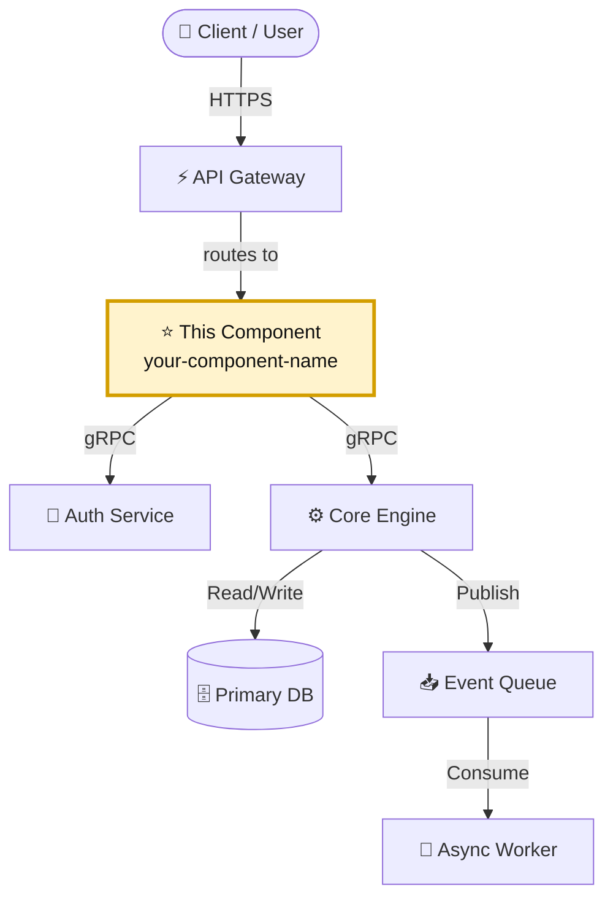

# 🚀 TITLE

> A concise, one to two sentence description of what this project does, who it is for, and the primary problem it solves.

---

## 📌 Project Metadata

* **Status:** 🟢 Active | 🟡 Deprecating | 🔴 Inactive
* **Data Classification:** 🌐 Public | 🏢 Internal | 🔒 Confidential | ⛔ Restricted

> ℹ️ *Use this section to identify which data classes the product handles: Public, Internal, Confidential, and Restricted.*
>
> 🧠 *These classifications align with the [NIST SP 800-122 Guide to Protecting the Confidentiality of Personally Identifiable Information (PII)](https://csrc.nist.gov/publications/detail/sp/800-122/final) framework. **Public** is explicitly classified as non-sensitive data outside NIST's non-public impact levels (Low, Moderate, and High).*

---

## 👥 Maintainers

|  Name | Role | Contact |
| :--- | :--- | :--- |
| **Jane Doe** | Lead Maintainer / Core | [@janedoe](https://github.com) <br><a href="mailto:noreply@gmail.com"></a> |
| **John Smith** | Security & Compliance | [@johnsmith](https://github.com) |
| **Alex Rivera** | DevOps & Infrastructure | [@arivera](https://github.com) |

---

## 🏗️ Architecture

A high-level overview of the system design and interaction flow.



## ⚡ Tech Stack

| Category | Technology | Usage |
| :--- | :--- | :--- |
| Language | Go / TypeScript | Application logic and APIs |
| Framework | Next.js / Gin | Frontend framework and REST services |
| Database | PostgreSQL | Primary relational data store |
| Cache / Queue | Redis | Session state and pub/sub messaging |
| Infrastructure | Docker / AWS | Containerization and cloud hosting |

### ⭐ This Component

> **Component:** `your-component-name`  
> **Responsibility:** One sentence describing the specific component represented by this repository.  
> **Location:** `path/to/component`  
> **Interfaces:** HTTP API, command line, event stream, or library API.

This repository represents **`your-component-name`**, not the entire example platform. Describe how it fits into the architecture above, which systems it depends on, and which systems depend on it.

## 📦 Installation

This application provides pre-compiled binaries for supported platforms via [GitHub Releases](https://github.com/your-org/your-repo/releases). Download the archive suitable for your operating system, then extract the binary to a location on your PATH, such as `/usr/local/bin`.

Verify installation: `coolapp --version`

## 🛡️ Security

Document the security boundary and operational expectations for this project. Replace the examples below with project-specific details.

### Network exposure

| Port / Protocol | Exposure | Purpose | Authentication |
| :--- | :--- | :--- | :--- |
| `443/tcp` | Public | HTTPS API or web application | User or service authentication |
| `8080/tcp` | Internal | Health checks or service-to-service traffic | Private network policy |
| `5432/tcp` | Restricted | PostgreSQL access | Database credentials and network allowlist |

Only expose ports that are required. Keep administrative interfaces, databases, metrics, and debugging endpoints on private networks unless there is a documented exception.

### Data handled

| Data type | Examples | Classification | Storage / retention |
| :--- | :--- | :--- | :--- |
| Identity data | User IDs, email addresses | Internal or confidential | Encrypted database, 90-day retention |
| Operational data | Logs, metrics, request IDs | Internal | Centralized logging, 30-day retention |
| Secrets | API keys, tokens, credentials | Restricted | Secret manager only; never commit to Git |

State whether the project handles personally identifiable information, payment data, health data, authentication material, customer content, or other regulated data. Document encryption in transit and at rest where applicable.

### Security controls

* Authentication and authorization: describe the identity provider, roles, and least-privilege model.
* Secrets management: describe where secrets are stored, rotated, and redacted from logs.
* Dependencies: describe dependency update and vulnerability scanning practices.
* Infrastructure: link to relevant IaC, container, cloud, and network security checks.
* Reporting: direct suspected vulnerabilities to [security contact or SECURITY.md](SECURITY.md).

## 🛠️ Development

### Prerequisites

Install the tools required to build and test the project locally:

* Go v1.22+ or Node.js v20+
* Docker Desktop

### Setup workspace

```bash
git clone https://github.com/your-org/your-repo.git
cd your-repo
```

Install project dependencies using the package manager documented by the project.

### Build

```bash
make build
```

Or manually:

```bash
go build -o bin/app ./cmd/app
```

### Test and lint

```bash
# Unit tests
make test

# Integration tests
make test-integration

# Linter
make lint
```
